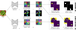

# SPOCO: Sparse Object-level Supervision for Instance Segmentation with Pixel Embeddings



This repository provides a PyTorch implementation of our method from the [paper](https://arxiv.org/abs/2103.14572):

```
@misc{wolny2021spoco,
      title={Sparse Object-level Supervision for Instance Segmentation with Pixel Embeddings}, 
      author={Adrian Wolny and Qin Yu and Constantin Pape and Anna Kreshuk},
      year={2021},
      eprint={2103.14572},
      archivePrefix={arXiv},
      primaryClass={cs.CV}
}
```

## Installation
Checkout the repo and set up conda environment:
```bash
conda env create -f environment.yaml
```

Activate the new environment:
```bash
conda activate spoco
```

## Training
This implementation uses `DistributedDataParallel` training. In order to restrict the number of GPUs used for training
use `CUDA_VISIBLE_DEVICES`, e.g. `CUDA_VISIBLE_DEVICES=0 python spoco_train.py ...` will execute training on `GPU:0`.

### CVPPP dataset 
We used A1 subset of the [CVPPP2017_LSC challenge](https://competitions.codalab.org/competitions/18405) for training. In order to train with 10% of randomly selected objects, run:
```bash
python spoco_train.py \
    --spoco \
    --ds-name cvppp --ds-path CVPPP_ROOT_DIR \
    --instance-ratio 0.1 \
    --batch-size 4  \
    --model-name UNet2D \
    --model-feature-maps 16 32 64 128 256 512 \ 
    --learning-rate 0.0002 \
    --weight-decay 0.00001 \
    --cos \
    --loss-delta-var 0.5 \
    --loss-delta-dist 2.0 \
    --loss-unlabeled-push 1.0 \ 
    --loss-instance-weight 1.0 \
    --loss-consistency-weight 1.0 \
    --kernel-threshold 0.5 \
    --checkpoint-dir CHECKPOINT_DIR \ 
    --log-after-iters 256  --max-num-iterations 80000 
```

`CVPPP_ROOT_DIR` is assumed to have the following subdirectories:
```
- train:
    - A1:
        - plantXXX_rgb.png
        - plantXXX_label.png
        ...
    - ...
    - A4:
        - ...
- val:
    - A1:
        - plantXXX_rgb.png
        - plantXXX_label.png
        ...
    - ...
    - A4:
        - ...

```
Since the CVPPP dataset consist of only `training` and `testing` subdirectories, one has to create the train/val split manually using the `training` subdir.

### Cityscapes Dataset
Download the images `leftImg8bit_trainvaltest.zip` and the labels `gtFine_trainvaltest.zip` from the [Cityscapes website](https://www.cityscapes-dataset.com/downloads)
and extract them into the `CITYSCAPES_ROOT_DIR` of your choice, so it has the following structure:
```
    - gtFine:
        - train
        - val
        - test

    - leftImg8bit:
        - train
        - val
        - test
```

Create random samplings of each class using the [cityscapesampler.py](spoco/datasets/cityscapesampler.py) script:
```bash
python spoco/datasets/cityscapesampler.py --base_dir CITYSCAPES_ROOT_DIR --class_names person rider car truck bus train motorcycle bicycle 
```
this will randomly sample 10%, 20%, ..., 90% of objects from the specified class(es) and save the results in dedicated directories,
e.g. `CITYSCAPES_ROOT_DIR/gtFine/train/darmstadt/car/0.4` will contain random 40% of objects of class `car`.

One can also sample from all of the objects (people, riders, cars, trucks, buses, trains, motorcycles, bicycles) collectively by simply:
```bash
python spoco/datasets/cityscapesampler.py --base_dir CITYSCAPES_ROOT_DIR 
```
this will randomly sample 10%, 20%, ..., 90% of **all** objects and save the results in dedicated directories,
e.g. `CITYSCAPES_ROOT_DIR/gtFine/train/darmstadt/all/0.4` will contain random 40% of all objects.

In order to train with 40% of randomly selected objects of class `car`, run:
```bash
python spoco_train.py \
    --spoco \
    --ds-name cityscapes 
    --ds-path CITYSCAPES_ROOT_DIR \
    --things-class car \
    --instance-ratio 0.4 \
    --batch-size 16  \
    --model-name UNet2D \
    --model-feature-maps 16 32 64 128 256 512 \
    --model-out-channels 8 \
    --learning-rate 0.001 \
    --weight-decay 0.00001 \
    --cos \
    --loss-delta-var 0.5 \
    --loss-delta-dist 2.0 \
    --loss-unlabeled-push 1.0 \ 
    --loss-instance-weight 1.0 \
    --loss-consistency-weight 1.0 \
    --kernel-threshold 0.5 \
    --checkpoint-dir CHECKPOINT_DIR \ 
    --log-after-iters 500  --max-num-iterations 90000 
```

In order to train with a random 40% of all ground truth objects, just remove the `--things-class` argument from the command above.

## Prediction
Give a model trained on the CVPPP dataset, run the prediction using the following command:
```bash
python spoco_predict.py \
    --spoco \
    --ds-name cvppp --ds-path CVPPP_ROOT_DIR \
    --batch-size 4 \ 
    --model-path MODEL_DIR/best_checkpoint.pytorch \
    --model-name UNet2D \
    --model-feature-maps 16 32 64 128 256 512 \
    --output-dir OUTPUT_DIR
```
Results will be saved in the given `OUTPUT_DIR` directory. For each test input image `plantXXX_rgb.png` the following
3 output files will be saved in the `OUTPUT_DIR`:
* `plantXXX_rgb_predictions.h5` - HDF5 file with datasets `/raw` (input image), `/embeddings1` (output from the `f` embedding network), `/embeddings2` (output from the `g` momentum contrast network)
* `plantXXX_rgb_predictions_1.png` - output from the `f` embedding network PCA-projected into the RGB-space
* `plantXXX_rgb_predictions_2.png` - output from the `g` momentum contrast network PCA-projected into the RGB-space

And similarly for the Cityscapes dataset 
```bash
python spoco_predict.py \
    --spoco \
    --ds-name cityscapes --ds-path CITYSCAPES_ROOT_DIR \ 
    --batch-size 16 \ 
    --model-path MODEL_DIR/best_checkpoint.pytorch \
    --model-name UNet2D \
    --model-feature-maps 16 32 64 128 256 512 \
    --model-out-channels 8 \
    --output-dir OUTPUT_DIR
```

## Clustering
To produce the final segmentation one needs to cluster the embeddings with and algorithm of choice. Supported
algoritms: mean-shift, HDBSCAN and Consistency Clustering (as described in the paper). E.g. to cluster CVPPP with HDBSCAN, run:
```bash
python cluster_predictions.py \ 
    --ds-name cvppp \
    --emb-dir PREDICTION_DIR \
    --clustering hdbscan --delta-var 0.5 --min-size 200 --remove-largest
```

Where `PREDICTION_DIR` is the directory where h5 files containing network predictions are stored. Resulting segmentation
will be saved as a separate dataset (named `segmentation`) inside each of the H5 prediction files.

In order to cluster the Cityscapes predictions and extract the instances of class `car` and compute the segmentation scores on the validation set:
```bash
python cluster_predictions.py \ 
    --ds-name cityscapes \
    --gt-dir CITYSCAPES_ROOT_DIR/gtFine/val \
    --emb-dir PREDICTION_DIR \
    --sem-dir SEM_PREDICTION_DIR \
    --things-class car \
    --clustering msplus --delta-var 0.5 --delta-dist 2.0
```
Where `SEM_PREDICTION_DIR` is the directory containing the semantic segmentation predictions for your validation images.
We used pre-trained DeepLabv3 model from [here](https://github.com/VainF/DeepLabV3Plus-Pytorch).
